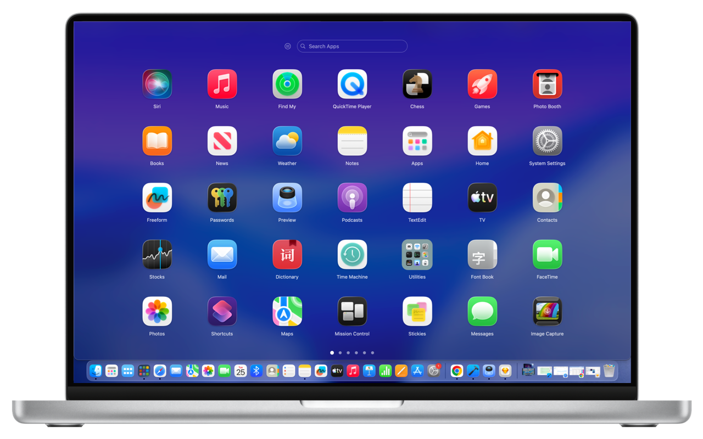
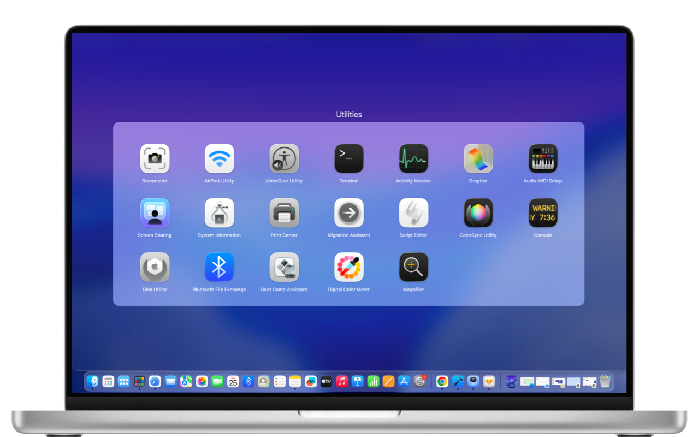

## Project introduction
AppPad is a Launchpad alternative for macOS 2.6, designed to help users rediscover the familiar Launchpad experience.

## Pagination

## Group

## Preferences

## video-demo

## Feature Highlights
1. Achieves Launchpad-level drag animations and smoothness comparable to its native counterpart, with a completely lag-free and incredibly fluid experience.

2. Supports paginated app display.

3. Supports dragging and dropping apps for grouping, reordering, and page adjustment.

4. Supports drag-and-drop page turning, mouse wheel page turning, and trackpad swipe page turning.

5. Supports quick app search.

6. Supports clicking app icons, shortcuts, trigger corners, and trackpad gestures to bring up Launchpad.

7. Supports windowed and full-screen Launchpad display.

8. Supports importing Launchpad layout data.

9. Supports AppPad layout data backup and restore.

## Official website
[AppPad](https://fineusing.com)

